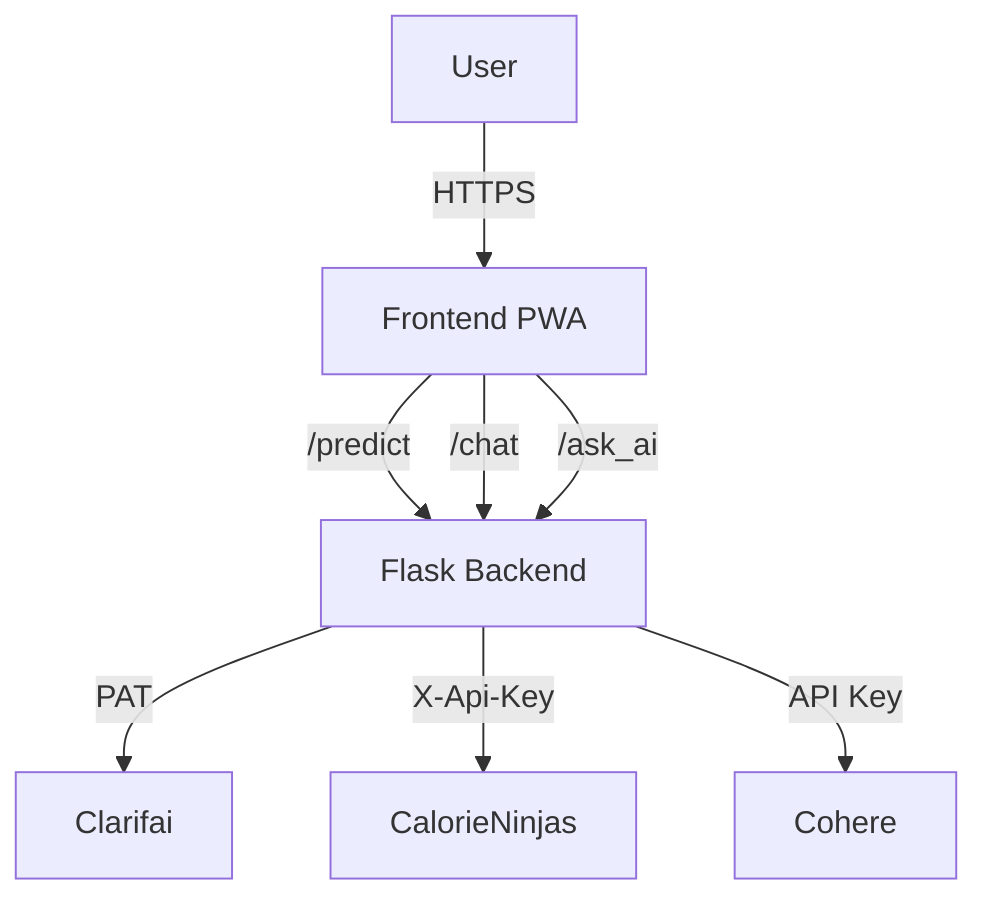

# 🍽️ FoodNinja - AI-Powered Food Recognition & Nutrition Advisory

[](https://app.netlify.com)
[](https://render.com)
[](https://web.dev/progressive-web-apps/)

> Ứng dụng Progressive Web App (PWA) sử dụng AI để nhận diện thực phẩm từ ảnh và cung cấp tư vấn dinh dưỡng thông minh.

## ✨ Tính năng chính

### 🤖 AI Integration
- **Clarifai Computer Vision**: Nhận diện món ăn từ ảnh với độ chính xác cao
- **CalorieNinjas Database**: Tra cứu thông tin dinh dưỡng chi tiết
- **Cohere AI**: Phân tích và tư vấn dinh dưỡng cá nhân hóa

### 📱 Progressive Web App
- Giao diện responsive cho desktop và mobile
- Có thể cài đặt như ứng dụng native
- Hoạt động offline với Service Worker
- Install banner tự động

### 📷 Nhận diện thông minh
- Upload ảnh hoặc chụp ảnh trực tiếp
- Drag & drop interface thân thiện
- Xử lý độ tin cậy thấp với hướng dẫn chi tiết
- Đề xuất cải thiện chất lượng ảnh

### 💬 Chatbot AI
- Tư vấn dinh dưỡng 24/7
- Lưu lịch sử hội thoại
- Floating UI không cản trở

### 🔒 Bảo mật & Hiệu suất
- Content Security Policy
- Proper cache headers
- Privacy-first (dữ liệu lưu local)
- Accessibility support (ARIA, screen reader)

## 🚀 Demo

**Frontend**: [https://foodninja-ai.netlify.app](https://foodninja-ai.netlify.app)  
**Backend API**: [https://foodninja-backend.render.com](https://foodninja-backend.render.com)  
**Repository**: [https://github.com/Duydzgithub/foodninja-ai](https://github.com/Duydzgithub/foodninja-ai)

## 🛠️ Công nghệ sử dụng

### Frontend
- **HTML5/CSS3/JavaScript ES6+**: Core technologies
- **Progressive Web App**: Service Worker, Web App Manifest
- **Responsive Design**: CSS Grid, Flexbox
- **Local Storage**: Chat history, recognition history

### Backend
- **Python Flask**: RESTful API server
- **Gunicorn**: WSGI server cho production
- **CORS**: Cross-origin resource sharing

### AI Services
- **Clarifai**: food-item-recognition model
- **CalorieNinjas**: Nutrition database API
- **Cohere**: command-a-03-2025 language model

### Deployment
- **Frontend**: Netlify (static hosting + CDN)
- **Backend**: Render (containerized Flask app)

## 📋 Cài đặt và Chạy

### Prerequisites
- Python 3.8+
- Node.js 16+ (cho build tools)
- Git

### 1. Clone Repository
```bash
git clone https://github.com/Duydzgithub/foodninja-ai.git
cd foodninja-ai
```

### 2. Backend Setup
```bash
# Cài đặt dependencies
pip install -r requirements.txt

# Thiết lập environment variables
cp .env.example .env
# Chỉnh sửa .env với API keys của bạn

# Chạy development server
python app.py
```

### 3. Frontend Setup
```bash
# Cài đặt dependencies (optional, cho diagram generation)
npm install

# Copy config file
cp config.example.js config.js
# Chỉnh sửa config.js với backend URL

# Serve static files (development)
# Sử dụng Live Server extension trong VS Code
# hoặc Python: python -m http.server 8000
```

### 4. Environment Variables

Backend `.env`:
```bash
CLARIFAI_PAT=your_clarifai_personal_access_token
CALORIE_API_KEY=your_calorieninjas_api_key
COHERE_API_KEY=your_cohere_api_key
ALLOWED_ORIGINS=http://localhost:8000,https://your-frontend-domain
MIN_CONFIDENCE=0.4
```

Frontend `config.js`:
```javascript
window.API_BASE = 'http://localhost:5000'; // Development
// window.API_BASE = 'https://your-backend.render.com'; // Production
```

## 🚀 Deployment

### Frontend (Netlify)
1. Fork repository và connect với Netlify
2. Set publish directory: root folder
3. Add build command: `npm run diagrams` (optional)
4. Configure custom domain
5. Update `config.js` với production backend URL

### Backend (Render)
1. Create Web Service từ repository
2. Set environment variables
3. Build command: `pip install -r requirements.txt`
4. Start command: `gunicorn app:app`
5. Update CORS settings với frontend domain

## 📊 System Architecture

### Block Diagram


### Confidence Handling Logic
- **≥ 40% confidence**: Full pipeline (recognition → nutrition → AI analysis)
- **< 40% confidence**: Show guidance + alternatives + manual AI query option

Chi tiết architecture tại: [`docs/architecture.md`](docs/architecture.md)

## 📱 PWA Features

- **Installable**: Add to Home Screen trên mobile/desktop
- **Offline Ready**: App shell cached với Service Worker
- **Responsive**: Hoạt động mượt mà trên mọi device
- **Fast Loading**: Cache static assets, network-first cho API

## 🔒 Security & Privacy

- **CSP**: Content Security Policy để ngăn XSS
- **Headers**: X-Content-Type-Options, Referrer-Policy
- **Privacy**: Không lưu dữ liệu user trên server
- **Local Storage**: Chat history và recognition history chỉ lưu local

## 🧪 Testing

### Manual Testing
1. Upload ảnh món ăn → kiểm tra kết quả nhận diện
2. Chụp ảnh từ camera → verify camera access
3. Chat với AI → test conversation flow
4. Install PWA → verify installation process
5. Offline mode → test cached functionality

### API Testing
```bash
# Test health check
curl https://your-backend.render.com/

# Test prediction (với image file)
curl -X POST -F "image=@test-food.jpg" https://your-backend.render.com/predict

# Test chat
curl -X POST -H "Content-Type: application/json" \
  -d '{"message":"Tôi nên ăn gì để giảm cân?"}' \
  https://your-backend.render.com/chat
```

## 🤝 Contributing

1. Fork repository
2. Create feature branch: `git checkout -b feature/AmazingFeature`
3. Commit changes: `git commit -m 'Add AmazingFeature'`
4. Push branch: `git push origin feature/AmazingFeature`
5. Open Pull Request

## 📄 License

This project is licensed under the MIT License - see the [LICENSE](LICENSE) file for details.

## 🙏 Acknowledgments

- **Clarifai** - Food recognition API
- **CalorieNinjas** - Nutrition database
- **Cohere** - AI language model
- **Netlify** - Frontend hosting
- **Render** - Backend hosting

## 📞 Support

- 📧 Email: duydzgithub@example.com
- 📚 Documentation: [docs/](docs/)
- 🐛 Issues: [GitHub Issues](https://github.com/Duydzgithub/foodninja-ai/issues)
- 💬 Discussions: [GitHub Discussions](https://github.com/Duydzgithub/foodninja-ai/discussions)

---

<p align="center">
  Made with ❤️ using AI and modern web technologies
</p>
